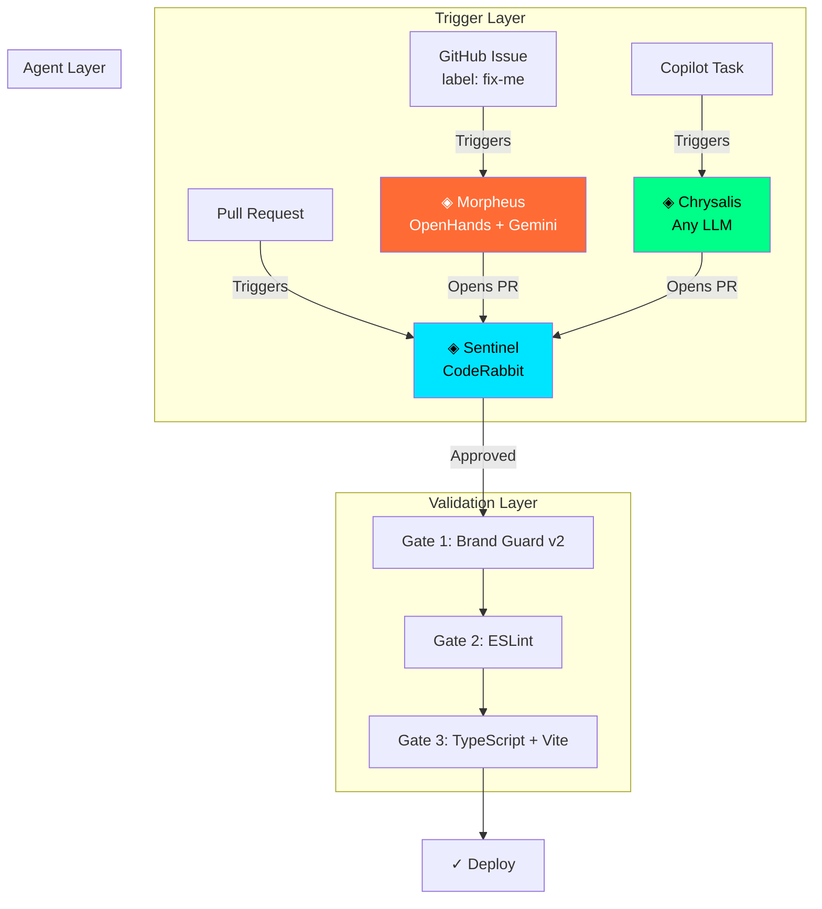

<div align="center">

<br/>

```
    ██╗      ██████╗ ██████╗  █████╗ ██████╗  ██████╗ ██╗  ██╗
    ██║     ██╔═══██╗██╔══██╗██╔══██╗██╔══██╗██╔═══██╗██║ ██╔╝
    ██║     ██║   ██║██████╔╝███████║██████╔╝██║   ██║█████╔╝
    ██║     ██║   ██║██╔══██╗██╔══██║██╔═══╝ ██║   ██║██╔═██╗
    ███████╗╚██████╔╝██║  ██║██║  ██║██║     ╚██████╔╝██║  ██╗
    ╚══════╝ ╚═════╝ ╚═╝  ╚═╝╚═╝  ╚═╝╚═╝      ╚═════╝ ╚═╝  ╚═╝

              ◈  A G E N T   F L E E T  ◈
```

# Lorapok Agent Fleet

**Where ideas metamorphose into shippable code.**

[](https://github.com/Maijied/Lorapok-Labs-Bible/actions)
[](https://github.com/marketplace/coderabbitai)
[](https://github.com/All-Hands-AI/OpenHands)
[](../LICENSE)
[](https://nodejs.org/)
[](chrysalis.yml)

[◈ Website](https://lorapok.github.io/) · [◈ Documentation](agents/) · [◈ Playbooks](playbooks/) · [◈ Brand Guard](scripts/brand-guard.mjs)

</div>

---

## Meet the CyberLarva

```
          ╭──────╮
         ╱ ◉    ◉ ╲        ← Glowing neon-green eyes
        │  ╰────╯  │          (scanning your code)
        │  ┌────┐  │
     ╭──┤  │ ▓▓ │  ├──╮    ← Dark-metallic armor plating
    ╱╲  │  └────┘  │  ╱╲
   ╱  ╲ ╰──────────╯ ╱  ╲  ← Cybernetic circuit-board shell
  ┊    ┊══════════════┊    ┊
  ┊    ┊──────────────┊    ┊ ← Segmented body with LED panels
   ╲  ╱ ╭──────────╮ ╲  ╱
    ╲╱  │  ░░░░░░  │  ╲╱   ← Internal glow (processing)
        │  ░░░░░░  │
        ╰──────────╯        ← Small robotic legs
```

The CyberLarva is the face of Lorapok Labs — a cybernetic Black Soldier Fly Larva that silently consumes bottlenecks and optimizes systems in the background. It appears throughout the agent fleet's CLI output in different states:

| State | When It Appears |
|-------|----------------|
| `working` | Scanning codebase, processing files |
| `success` | All checks passed, PR ready |
| `error` | Violations detected, build failed |
| `morpheus` | Autonomous issue resolution in progress |
| `sentinel` | Code review active |
| `idle` | Agent ready, awaiting tasks |

---

## Overview

The **Lorapok Agent Fleet** is a multi-AI agent ecosystem that ensures every line of code shipped from Lorapok Labs is built on-brand, reviewed intelligently, and resolved autonomously — without requiring expensive paid licenses.

```
┌─────────────────────────────────────────────────────────────────────────────┐
│                                                                             │
│   ◈ LORAPOK AGENT FLEET — Pipeline                                         │
│                                                                             │
│   ┌─────────────┐      ┌─────────────┐      ┌─────────────┐               │
│   │  MORPHEUS   │      │  CHRYSALIS  │      │  SENTINEL   │               │
│   │  ─────────  │      │  ─────────  │      │  ─────────  │               │
│   │  Issue      │─────▶│  Build      │─────▶│  Review     │               │
│   │  Resolver   │      │  Agent      │      │  Agent      │               │
│   │             │      │             │      │             │               │
│   │  OpenHands  │      │  Copilot /  │      │  CodeRabbit │               │
│   │  (Free+BYOK)│      │  Any LLM    │      │  (Free OSS) │               │
│   └─────────────┘      └─────────────┘      └─────────────┘               │
│         │                     │                     │                       │
│         ▼                     ▼                     ▼                       │
│   ┌─────────────────────────────────────────────────────────┐             │
│   │              CHRYSALIS GATES (CI)                         │             │
│   │   Gate 1: Brand Guard  │  Gate 2: Lint  │  Gate 3: Build │             │
│   └─────────────────────────────────────────────────────────┘             │
│                              │                                             │
│                              ▼                                             │
│                     ✓ Ship to Production                                   │
│                                                                             │
└─────────────────────────────────────────────────────────────────────────────┘
```

---

## The Three Agents

| Agent | Role | Platform | Cost | Trigger |
|-------|------|----------|------|---------|
| [**◈ Chrysalis**](agents/chrysalis.md) | Brand-Compliant Builder | GitHub Copilot / Any LLM | Varies | Task assignment |
| [**◈ Sentinel**](agents/sentinel.md) | AI Code Reviewer | CodeRabbit | **Free (OSS)** | Every PR (automatic) |
| [**◈ Morpheus**](agents/morpheus.md) | Autonomous Issue Resolver | OpenHands | **Free + BYOK** | Label: `fix-me` |

---

## Quick Start

### 1. Sentinel (CodeRabbit) — Instant Setup

```
     ╭───────────────────────────╮
     │   ◈ SENTINEL ACTIVATING   │
     ╰───────────────────────────╯
           ╭──────╮
          ╱ 👁  👁 ╲
         │  ╰────╯  │   🔍
          ╰──────────╯
```

1. Visit [github.com/marketplace/coderabbitai](https://github.com/marketplace/coderabbitai)
2. Select **Open Source** plan ($0/month forever)
3. Grant access to your repository
4. **Done** — Sentinel reviews every PR automatically

### 2. Morpheus (OpenHands) — 2-Minute Setup

```
     ╭───────────────────────────╮
     │   ◈ MORPHEUS ACTIVATING   │
     ╰───────────────────────────╯
           ╭──────╮
          ╱ ◉    ◉ ╲
         │  ╰────╯  │   🔧
          ╰──────────╯
```

1. Get a free API key from [aistudio.google.com/apikey](https://aistudio.google.com/apikey)
2. Add secrets to **Settings → Secrets → Actions**:

   | Secret | Value |
   |--------|-------|
   | `LLM_API_KEY` | Your Gemini API key |
   | `LLM_MODEL` | `google/gemini-2.5-flash` |

3. Create any issue → add label `fix-me` → Morpheus resolves it

### 3. Chrysalis (Copilot) — Optional

Requires a GitHub Copilot license. If you have one:
1. Settings → Copilot → Coding agent → Enable
2. Assign tasks from the Agents tab

**No Copilot?** Morpheus + Sentinel cover 90% of use cases for free.

---

## Brand Guard Engine v2.0

The signature feature — a zero-dependency compliance scanner with CyberLarva animations:

```
  ╔════════════════════════════════════════════════════════╗
  ║  ◈ LORAPOK CHRYSALIS — Brand Guard v2.0.0             ║
  ║  "No PR ships off-brand."                             ║
  ╚════════════════════════════════════════════════════════╝

          ╭──────╮
         ╱ ★    ★ ╲
        │  ╰─▽──╯  │    ✨
        │  ┌────┐  │
     ╭──┤  │ ▓▓ │  ├──╮
    ╱╲  │  └────┘  │  ╱╲  ✓
   ╱  ╲ ╰──────────╯ ╱  ╲
  ┊    ┊══════════════┊    ┊
  ┊    ┊──────────────┊    ┊
   ╲  ╱ ╭──────────╮ ╲  ╱
    ╲╱  │  ░░▓▓░░  │  ╲╱
        │  ░░▓▓░░  │
        ╰──────────╯
     ⚡ All systems nominal ⚡

  ────────────────────────────────────────────────────────
  Agent: brand-guard
  Duration: 0.01s
  Files scanned: 43
  ✓ All brand checks passed. The chrysalis holds.

  ◈ Log written: .lorapok/logs/brand-guard_2026-05-20.log
```

### Rules Enforced

| ID | Severity | What It Catches |
|----|----------|----------------|
| `no-browser-router` | 🔴 Error | BrowserRouter (breaks GitHub Pages) |
| `no-tailwind` | 🔴 Error | Tailwind imports/classes |
| `no-css-in-js` | 🔴 Error | styled-components, Emotion |
| `no-backend-deps` | 🔴 Error | Express, Fastify, Koa, etc. |
| `no-any-type` | 🟡 Warn | TypeScript `any` without override |
| `no-inline-color` | 🟡 Warn | Hardcoded colors outside tokens |
| `no-react-fc` | 🟡 Warn | Deprecated React.FC pattern |
| `no-direct-main-push` | 🟡 Warn | References to pushing to main |

### Usage

```bash
# Standard run (with CyberLarva animation)
node .lorapok/scripts/brand-guard.mjs

# Verbose (shows matched text)
node .lorapok/scripts/brand-guard.mjs --verbose

# With fix suggestions
node .lorapok/scripts/brand-guard.mjs --fix-suggestions

# JSON output (for CI integration)
node .lorapok/scripts/brand-guard.mjs --json

# Skip log file
node .lorapok/scripts/brand-guard.mjs --no-log
```

### Logging System

Every Brand Guard run writes a structured log to `.lorapok/logs/`:

```
╔══════════════════════════════════════════════════════════════╗
║  LORAPOK BRAND-GUARD — Log File
║  Generated: 2026-05-20T06:44:41.900Z
║  Duration: 0.01s
╚══════════════════════════════════════════════════════════════╝
[06:44:41.888] [LARVA  ] working
[06:44:41.888] [HEADER ] LORAPOK CHRYSALIS — Brand Guard v2.0.0
[06:44:41.890] [INFO   ] Scanning 43 files in app/src/...
[06:44:41.899] [LARVA  ] success
[06:44:41.899] [SUMMARY] Completed in 0.01s | {"files":43,"errors":0,"warnings":0}
```

---

## Playbook System

| Playbook | Trigger | File |
|----------|---------|------|
| **Add Page** | "add a new page/route" | [`playbooks/add-page.md`](playbooks/add-page.md) |
| **Add Product** | "add a product to catalog" | [`playbooks/add-product.md`](playbooks/add-product.md) |
| **Add Data Entry** | "add achievements/skills/links" | [`playbooks/add-data-entry.md`](playbooks/add-data-entry.md) |
| **Refactor Component** | "extract/split a component" | [`playbooks/refactor-component.md`](playbooks/refactor-component.md) |

---

## Architecture



---

## File Structure

```bash
.lorapok/
├── README.md                    # ← You are here
├── chrysalis.yml                # Fleet manifest (apiVersion: lorapok.dev/v1)
├── agents/
│   ├── chrysalis.md             # Builder agent documentation
│   ├── sentinel.md              # Reviewer agent documentation
│   └── morpheus.md              # Resolver agent documentation
├── playbooks/
│   ├── add-page.md
│   ├── add-product.md
│   ├── add-data-entry.md
│   └── refactor-component.md
├── scripts/
│   ├── brand-guard.mjs          # Compliance scanner v2.0
│   └── logger.mjs              # Branded logging utility
└── logs/
    ├── .gitkeep
    └── *.log                    # Runtime logs (gitignored)
```

---

## Supported LLM Providers (for Morpheus)

| Provider | Model | Context | Cost | Speed |
|----------|-------|---------|------|-------|
| **Google Gemini** | gemini-2.5-flash | **1M tokens** | Free | Fast |
| Google Gemini | gemini-2.5-pro | 1M tokens | Free | Medium |
| Groq | llama-3.3-70b | 128K tokens | Free | Blazing |
| OpenRouter | ring-2.6-1t:free | 256K tokens | Free | Medium |
| DeepSeek | deepseek-chat | 128K tokens | ~Free | Fast |
| Anthropic | claude-sonnet-4 | 200K tokens | Paid | Fast |
| OpenAI | gpt-4o | 128K tokens | Paid | Fast |

---

## Roadmap

| Phase | Milestone | Status |
|-------|-----------|--------|
| 1 | Multi-agent fleet with Brand Guard v2 | ✅ Complete |
| 2 | CyberLarva animations + logging system | ✅ Complete |
| 3 | Reusable composite GitHub Action | 🔜 Planned |
| 4 | Lorapok CLI (`npx lorapok init`) | 🔜 Planned |
| 5 | GitHub Marketplace listing | 🔜 Planned |
| 6 | Fleet orchestration dashboard | 🔜 Planned |

---

## The Lorapok Ecosystem

| Product | Description | Link |
|---------|-------------|------|
| **Lorapok Labs Bible** | Brand Guide & Website | [Live](https://maijied.github.io/Lorapok-Labs-Bible/) |
| **Lorapok Atlas** | API Directory & Discovery | [Live](https://maijied.github.io/Lorapok-API_Atlas/) |
| **Roast as a Service** | Code Roasting Engine | [Live](https://maijied.github.io/roast-as-a-service/) |
| **Dynamic Ollama Chat** | Local LLM Interface | [Live](https://maijied.github.io/Lorapok-Dynamic-Ollama-LLM-Chat-Interface/) |
| **Lorapok AI Agent** | Autonomous AI Agent | [Repo](https://github.com/Maijied/Lorapok_AI_Agent) |
| **Lorapok TabMan** | Firefox Tab Manager | [Live](https://maijied.github.io/Lorapok-TabMan/) |
| **Laravel Execution Monitor** | Backend Observability | [Packagist](https://packagist.org/packages/lorapok/laravel-execution-monitor) |

---

## Contributing

1. Fork the repository
2. Create a feature branch: `feat/your-feature`
3. Run the Chrysalis Gates:
   ```bash
   node .lorapok/scripts/brand-guard.mjs
   cd app && npm run lint && npm run build
   ```
4. Open a PR — Sentinel reviews automatically

---

## License

MIT — Built with 🧬 by [Lorapok Labs](https://lorapok.github.io/)

---

<div align="center">

<br/>

**◈ "Building the Future. One Line at a Time." ◈**

[Website](https://lorapok.github.io/) · [GitHub](https://github.com/Lorapok) · [LinkedIn](https://www.linkedin.com/showcase/lorapok/) · [Reddit](https://www.reddit.com/r/LorapokLabs/) · [Instagram](https://www.instagram.com/lorapoklabs/)

<br/>

</div>
