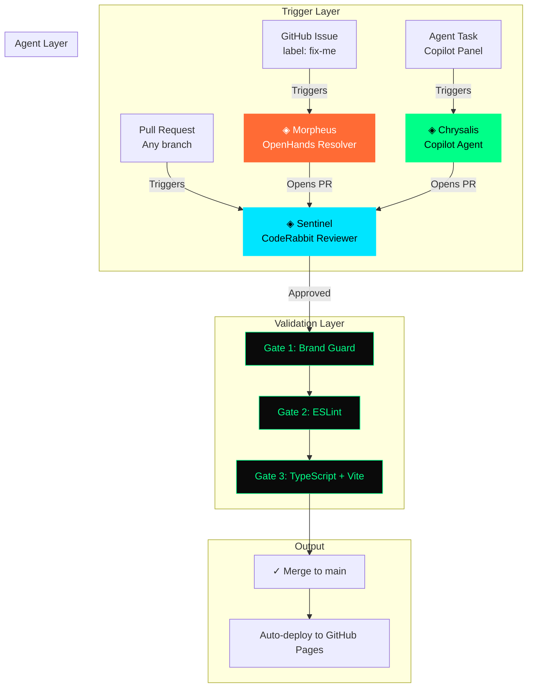

<div align="center">

<br/>

```
    ██╗      ██████╗ ██████╗  █████╗ ██████╗  ██████╗ ██╗  ██╗
    ██║     ██╔═══██╗██╔══██╗██╔══██╗██╔══██╗██╔═══██╗██║ ██╔╝
    ██║     ██║   ██║██████╔╝███████║██████╔╝██║   ██║█████╔╝
    ██║     ██║   ██║██╔══██╗██╔══██║██╔═══╝ ██║   ██║██╔═██╗
    ███████╗╚██████╔╝██║  ██║██║  ██║██║     ╚██████╔╝██║  ██╗
    ╚══════╝ ╚═════╝ ╚═╝  ╚═╝╚═╝  ╚═╝╚═╝      ╚═════╝ ╚═╝  ╚═╝

              ◈  A G E N T   F L E E T  ◈
```

# Lorapok Agent Fleet

**Where ideas metamorphose into shippable code.**

[](https://github.com/Maijied/Lorapok-Labs-Bible/actions)
[](https://github.com/marketplace/coderabbitai)
[](https://github.com/All-Hands-AI/OpenHands)
[](../LICENSE)
[](https://nodejs.org/)
[](chrysalis.yml)

[◈ Website](https://lorapok.github.io/) · [◈ Documentation](agents/) · [◈ Playbooks](playbooks/) · [◈ Brand Guard](scripts/brand-guard.mjs)

</div>

---

## Overview

The **Lorapok Agent Fleet** is a multi-AI agent ecosystem that ensures every line of code shipped from Lorapok Labs is built on-brand, reviewed intelligently, and tested autonomously — without requiring expensive paid licenses.

It combines three specialized agents into a unified pipeline:

```
┌─────────────────────────────────────────────────────────────────────────────┐
│                                                                             │
│   ◈ LORAPOK AGENT FLEET — Pipeline                                         │
│                                                                             │
│   ┌─────────────┐      ┌─────────────┐      ┌─────────────┐               │
│   │  MORPHEUS   │      │  CHRYSALIS  │      │  SENTINEL   │               │
│   │  ─────────  │      │  ─────────  │      │  ─────────  │               │
│   │  Issue      │─────▶│  Build      │─────▶│  Review     │               │
│   │  Resolver   │      │  Agent      │      │  Agent      │               │
│   │             │      │             │      │             │               │
│   │  OpenHands  │      │  Copilot /  │      │  CodeRabbit │               │
│   │  SWE-Agent  │      │  Any LLM    │      │  (Free OSS) │               │
│   └─────────────┘      └─────────────┘      └─────────────┘               │
│         │                     │                     │                       │
│         ▼                     ▼                     ▼                       │
│   ┌─────────────────────────────────────────────────────────┐             │
│   │              CHRYSALIS GATES (CI)                         │             │
│   │   Gate 1: Brand Guard  │  Gate 2: Lint  │  Gate 3: Build │             │
│   └─────────────────────────────────────────────────────────┘             │
│                              │                                             │
│                              ▼                                             │
│                     ✓ Ship to Production                                   │
│                                                                             │
└─────────────────────────────────────────────────────────────────────────────┘
```

---

## The Three Agents

| Agent | Role | Platform | Cost | Config |
|-------|------|----------|------|--------|
| [**◈ Chrysalis**](agents/chrysalis.md) | Brand-Compliant Builder | GitHub Copilot / Any LLM | Varies | `.github/copilot-instructions.md` |
| [**◈ Sentinel**](agents/sentinel.md) | AI Code Reviewer | CodeRabbit | **Free for OSS** | `.coderabbit.yaml` |
| [**◈ Morpheus**](agents/morpheus.md) | Autonomous Issue Resolver | OpenHands | **Free + BYOK** | `.github/workflows/openhands-resolver.yml` |

### Why These Three?

| Problem | Without Fleet | With Fleet |
|---------|--------------|------------|
| AI writes off-brand code | Manual review catches it (maybe) | Brand Guard blocks it automatically |
| PRs sit unreviewed | Bottleneck on human reviewers | Sentinel reviews instantly, 24/7 |
| Issues pile up | Wait for developer bandwidth | Morpheus resolves labeled issues autonomously |
| No Copilot license | Can't use AI agents at all | Morpheus + Sentinel work without Copilot license |

---

## Architecture Overview



---

## Quick Start

### 1. Install Sentinel (CodeRabbit) — Free for Open Source

1. Go to [github.com/marketplace/coderabbitai](https://github.com/marketplace/coderabbitai)
2. Click **"Set up a free trial"** → Select the **Open Source** plan (free forever)
3. Grant access to your repository
4. Done — Sentinel will review every PR automatically using the `.coderabbit.yaml` config

### 2. Enable Morpheus (OpenHands) — Free + Bring Your Own Key

1. Add these secrets to your repo (**Settings → Secrets → Actions**):

   | Secret | Description | Example |
   |--------|-------------|---------|
   | `LLM_API_KEY` | Your LLM provider API key | `sk-ant-...` or `sk-...` |
   | `LLM_MODEL` | Model identifier | `anthropic/claude-sonnet-4-20250514` |
   | `LLM_BASE_URL` | (Optional) Custom endpoint | `https://api.openai.com/v1` |

2. Label any issue with `fix-me` → Morpheus will attempt a fix and open a PR
3. Or comment `@openhands-agent` on any issue to trigger manually

### 3. Enable Chrysalis (Copilot) — Requires Copilot License

> **Note:** If you don't have a Copilot license, Morpheus + Sentinel still work perfectly.

1. Repo → **Settings** → **Copilot** → **Coding agent** → Enable
2. Assign tasks from the **Agents** tab or assign Copilot to issues
3. Chrysalis reads `.github/copilot-instructions.md` automatically

---

## Brand Guard Engine

The signature feature of the Lorapok Agent Fleet — a zero-dependency compliance scanner:

```
  ╔══════════════════════════════════════════════════════════╗
  ║  ◈ LORAPOK CHRYSALIS — Brand Guard v1.0.0               ║
  ║  "No PR ships off-brand."                               ║
  ╚══════════════════════════════════════════════════════════╝

  ──────────────────────────────────────────────────────────
  Files scanned: 43
  ✓ All brand checks passed. The chrysalis holds.
```

### Rules Enforced

| ID | Severity | What It Catches |
|----|----------|----------------|
| `no-browser-router` | 🔴 Error | BrowserRouter (breaks GitHub Pages) |
| `no-tailwind` | 🔴 Error | Tailwind imports/classes |
| `no-css-in-js` | 🔴 Error | styled-components, Emotion |
| `no-backend-deps` | 🔴 Error | Express, Fastify, Koa, etc. |
| `no-any-type` | 🟡 Warn | TypeScript `any` without override |
| `no-inline-color` | 🟡 Warn | Hardcoded colors outside tokens |
| `no-react-fc` | 🟡 Warn | Deprecated React.FC pattern |
| `no-direct-main-push` | 🟡 Warn | References to pushing to main |

### Usage

```bash
# Standard run
node .lorapok/scripts/brand-guard.mjs

# Verbose (shows matched text)
node .lorapok/scripts/brand-guard.mjs --verbose

# With fix suggestions
node .lorapok/scripts/brand-guard.mjs --fix-suggestions

# JSON output (for CI integration)
node .lorapok/scripts/brand-guard.mjs --json
```

### Inline Suppression

```typescript
const legacy = value as any; // brand-guard-ignore
```

---

## Playbook System

Repeatable recipes that guide agents through common task types:

| Playbook | Trigger | File |
|----------|---------|------|
| **Add Page** | "add a new page/route" | [`playbooks/add-page.md`](playbooks/add-page.md) |
| **Add Product** | "add a product to catalog" | [`playbooks/add-product.md`](playbooks/add-product.md) |
| **Add Data Entry** | "add achievements/skills/links" | [`playbooks/add-data-entry.md`](playbooks/add-data-entry.md) |
| **Refactor Component** | "extract/split a component" | [`playbooks/refactor-component.md`](playbooks/refactor-component.md) |

Each playbook contains:
- **Trigger condition** — when to activate
- **Step-by-step checklist** — deterministic instructions
- **File templates** — starter code
- **Brand rules** — aesthetic requirements
- **Anti-patterns** — what to avoid

---

## File Structure

```bash
.lorapok/
├── README.md                    # ← You are here
├── chrysalis.yml                # Fleet manifest (apiVersion: lorapok.dev/v1)
├── agents/
│   ├── chrysalis.md             # Chrysalis documentation
│   ├── sentinel.md              # Sentinel documentation
│   └── morpheus.md              # Morpheus documentation
├── playbooks/
│   ├── add-page.md              # Recipe: new routes
│   ├── add-product.md           # Recipe: ecosystem products
│   ├── add-data-entry.md        # Recipe: achievements/skills/links
│   └── refactor-component.md    # Recipe: component extraction
└── scripts/
    └── brand-guard.mjs          # Zero-dep compliance scanner

# Related files (outside .lorapok/):
.github/copilot-instructions.md        # Chrysalis agent identity
.github/workflows/copilot-setup-steps.yml  # Chrysalis CI gates
.github/workflows/openhands-resolver.yml   # Morpheus workflow
.coderabbit.yaml                           # Sentinel configuration
```

---

## Agent Manifest Schema

The `chrysalis.yml` uses a custom schema designed for future Lorapok tooling:

```yaml
apiVersion: lorapok.dev/v1    # Versioned schema
kind: AgentFleet              # Resource type

metadata:                     # Fleet-level metadata
  name: Lorapok Agent Fleet
  version: 1.0.0

agents:                       # Individual agent definitions
  - id: lorapok-chrysalis
    name: Lorapok Chrysalis
    role: Brand-Compliant Builder
    platforms: [...]
    config: [...]

capabilities:                 # Shared validation & playbooks
  validation: [...]
  playbooks: [...]
  guardrails: [...]
```

This enables:
- **Auto-discovery** by future Lorapok CLI
- **Marketplace listing** metadata extraction
- **Multi-repo orchestration** with consistent schemas
- **Version-controlled** agent behavior

---

## Extending the Fleet

### Add a New Agent

1. Add entry to `chrysalis.yml` under `agents:`
2. Create documentation at `.lorapok/agents/<name>.md`
3. Create config file (workflow, YAML, etc.)
4. Update this README

### Add a New Playbook

1. Create `.lorapok/playbooks/<task-type>.md`
2. Follow structure: Trigger → Checklist → Template → Brand Rules → Anti-Patterns
3. Register in `chrysalis.yml` under `capabilities.playbooks.catalog`
4. Reference in `.github/copilot-instructions.md`

### Add a Brand Guard Rule

1. Add entry to `RULES` array in `scripts/brand-guard.mjs`
2. Test: `node .lorapok/scripts/brand-guard.mjs --verbose`
3. Document in this README's Rules table

---

## Roadmap

| Phase | Milestone | Status |
|-------|-----------|--------|
| 1 | Multi-agent fleet with Brand Guard | ✅ Complete |
| 2 | Reusable composite GitHub Action | 🔜 Planned |
| 3 | Lorapok CLI (`npx lorapok init`) | 🔜 Planned |
| 4 | GitHub Marketplace listing | 🔜 Planned |
| 5 | Fleet orchestration (agents coordinating) | 🔜 Planned |
| 6 | Visual dashboard for fleet status | 🔜 Planned |

---

## Design Philosophy

The fleet follows **Lorapok Labs** core principles:

| Principle | How the Fleet Embodies It |
|-----------|--------------------------|
| **Zero-config efficiency** | Drop `.lorapok/` into any repo → agents work immediately |
| **Silent background optimization** | Brand Guard + Sentinel run invisibly, only surface violations |
| **Digital metamorphosis** | Issues → autonomous fixes → reviewed PRs → shipped features |
| **Products That Feel Alive** | Branded CLI output, personality in agent responses, evolving behavior |

---

## The Lorapok Ecosystem

| Product | Description | Link |
|---------|-------------|------|
| **Lorapok Labs Bible** | Brand Guide & Website | [Live](https://maijied.github.io/Lorapok-Labs-Bible/) |
| **Lorapok Atlas** | API Directory & Discovery | [Live](https://maijied.github.io/Lorapok-API_Atlas/) |
| **Roast as a Service** | Code Roasting Engine | [Live](https://maijied.github.io/roast-as-a-service/) |
| **Dynamic Ollama Chat** | Local LLM Interface | [Live](https://maijied.github.io/Lorapok-Dynamic-Ollama-LLM-Chat-Interface/) |
| **Lorapok AI Agent** | Autonomous AI Agent | [Repo](https://github.com/Maijied/Lorapok_AI_Agent) |
| **Lorapok TabMan** | Firefox Tab Manager | [Live](https://maijied.github.io/Lorapok-TabMan/) |
| **Laravel Execution Monitor** | Backend Observability | [Packagist](https://packagist.org/packages/lorapok/laravel-execution-monitor) |
| **Lorapok BrainSpark** | Neural Micro-Games | [Live](https://lorapok.github.io/brainspark) |

---

## Contributing

1. Fork the repository
2. Create a feature branch: `feat/your-feature`
3. Follow the [coding conventions](../.github/copilot-instructions.md)
4. Run the Chrysalis Gates:
   ```bash
   node .lorapok/scripts/brand-guard.mjs
   cd app && npm run lint && npm run build
   ```
5. Open a PR — Sentinel will review it automatically

---

## License

MIT — Built with 🧬 by [Lorapok Labs](https://lorapok.github.io/)

---

<div align="center">

<br/>

**◈ "Building the Future. One Line at a Time." ◈**

[Website](https://lorapok.github.io/) · [GitHub](https://github.com/Lorapok) · [LinkedIn](https://www.linkedin.com/showcase/lorapok/) · [Reddit](https://www.reddit.com/r/LorapokLabs/) · [Instagram](https://www.instagram.com/lorapoklabs/)

<br/>

</div>
