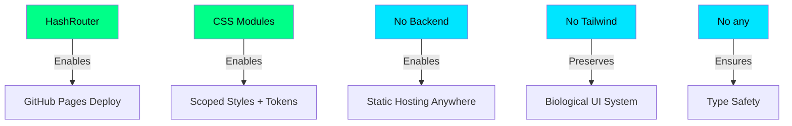

<div align="center">

<br/>

```
     ██████╗██╗  ██╗██████╗ ██╗   ██╗███████╗ █████╗ ██╗     ██╗███████╗
    ██╔════╝██║  ██║██╔══██╗╚██╗ ██╔╝██╔════╝██╔══██╗██║     ██║██╔════╝
    ██║     ███████║██████╔╝ ╚████╔╝ ███████╗███████║██║     ██║███████╗
    ██║     ██╔══██║██╔══██╗  ╚██╔╝  ╚════██║██╔══██║██║     ██║╚════██║
    ╚██████╗██║  ██║██║  ██║   ██║   ███████║██║  ██║███████╗██║███████║
     ╚═════╝╚═╝  ╚═╝╚═╝  ╚═╝   ╚═╝   ╚══════╝╚═╝  ╚═╝╚══════╝╚═╝╚══════╝

            ◈  T H E   B R A N D - C O M P L I A N T   B U I L D E R  ◈
```

# ◈ Chrysalis

**"Where ideas metamorphose into shippable code."**

[](https://github.com/features/copilot)
[](https://github.com/Maijied/Lorapok-Labs-Bible/actions)
[](../.lorapok/chrysalis.yml)
[](../../LICENSE)

</div>

---

## CyberLarva — `working` State

```
     ╭───────────────────────────────────╮
     │   ◈ CHRYSALIS — Building...       │
     ╰───────────────────────────────────╯

              ╭──────────╮
             ╱ ◉        ◉ ╲         ← Neon-green eyes (focused)
            │  ╰────────╯  │
            │  ┌──┬──┬──┐  │        ← Circuit-board faceplate
            │  │▓▓│░░│▓▓│  │
         ╭──┤  └──┴──┴──┘  ├──╮     ← Dark-metallic armor plating
        ╱╲  │  ═══╤══╤═══  │  ╱╲
       ╱  ╲ │  ───┼──┼───  │ ╱  ╲   ← PCB trace patterns
      ┊ ▒▒ ┊╰─────┼──┼─────╯┊ ▒▒ ┊
      ┊ ▒▒ ┊══════╧══╧══════┊ ▒▒ ┊  ← LED status panels (active)
       ╲  ╱ ╭──────────────╮ ╲  ╱
        ╲╱  │  ░▓░▓░▓░▓░▓ │  ╲╱    ← Data bus (processing)
            │  ▓░▓░▓░▓░▓░ │
            ╰──────────────╯
         ⚡ ╰┤ ╰┤ ╰┤ ╰┤ ╰┤ ⚡      ← Robotic legs (in motion)

     Building on-brand. Every line. Every time.
```

---

## What is Chrysalis?

**Chrysalis** is the Brand-Compliant Builder agent in the Lorapok Agent Fleet. It transforms tasks into production-ready code that adheres to the Lorapok Labs brand system — from file naming conventions to CSS token usage, routing patterns, and component architecture.

Chrysalis works by loading a rich instruction set (via `copilot-instructions.md`) and executing structured playbooks that encode the team's architectural decisions. Every piece of code it generates passes through the **Chrysalis Gates** — a multi-stage CI pipeline that enforces brand compliance, lint rules, and build integrity.

> **Key Insight:** Chrysalis is NOT tied to GitHub Copilot. It works with **any LLM** that can read markdown instructions — Claude, GPT-4, Gemini, Llama, or local models via Ollama.

---

## How It Works


| Step | Action | Details |
|------|--------|---------|
| **1** | **Receive Task** | Assigned via GitHub Copilot Agent, issue, or direct prompt |
| **2** | **Load Context** | Reads `copilot-instructions.md` — the full brand ruleset |
| **3** | **Match Playbook** | Detects task type → loads the appropriate playbook template |
| **4** | **Execute** | Generates code following brand tokens, patterns, and file conventions |
| **5** | **Validate Gates** | Runs Brand Guard → ESLint → TypeScript + Vite Build |
| **6** | **Open PR** | Creates a pull request for Sentinel to review |

---

## Configuration

Chrysalis relies on two key configuration files:

### `copilot-instructions.md`

The primary instruction set. Contains:
- Tech stack constraints (React 18, Vite, CSS Modules, HashRouter)
- File naming conventions (PascalCase components, camelCase utils)
- Brand color tokens and usage rules
- Component architecture patterns
- Import ordering rules
- Accessibility requirements

### `copilot-setup-steps.yml`

The CI workflow that runs Chrysalis Gates on every PR:

```yaml
# .github/workflows/copilot-setup-steps.yml
name: Chrysalis Gates
on:
  pull_request:
    branches: [main]

jobs:
  gates:
    runs-on: ubuntu-latest
    steps:
      - uses: actions/checkout@v4
      - uses: actions/setup-node@v4
        with:
          node-version: 20
      - run: cd app && npm ci
      - run: node .lorapok/scripts/brand-guard.mjs   # Gate 1
      - run: cd app && npx eslint .                   # Gate 2
      - run: cd app && npm run build                  # Gate 3
```

---

## Playbooks

Playbooks are structured task templates that guide Chrysalis through common operations:

| Playbook | Trigger Phrase | What It Does |
|----------|---------------|--------------|
| [`add-page`](../playbooks/add-page.md) | "Add a new page/route" | Creates page component, CSS module, route entry, nav data |
| [`add-product`](../playbooks/add-product.md) | "Add a product to catalog" | Adds entry to `products.ts`, validates icon, generates card |
| [`add-data-entry`](../playbooks/add-data-entry.md) | "Add achievements/skills/links" | Appends to typed data arrays with proper interfaces |
| [`refactor-component`](../playbooks/refactor-component.md) | "Extract/split a component" | Splits monoliths, preserves CSS modules, updates imports |

### Playbook Structure

Each playbook follows this format:

```markdown
# Playbook: [Name]

## Context
What this playbook solves.

## Pre-conditions
Files that must exist.

## Steps
1. Create file at [path]
2. Use template [X]
3. Register in [location]

## Post-conditions
What must be true after execution.

## Validation
Brand Guard rules that apply.
```

---

## Chrysalis Gates

Every PR must pass through three sequential gates before merge:

```
  ┌─────────────────────────────────────────────────────────────────┐
  │                    CHRYSALIS GATES PIPELINE                       │
  │                                                                   │
  │   ┌──────────────┐    ┌──────────────┐    ┌──────────────┐      │
  │   │   GATE 1     │    │   GATE 2     │    │   GATE 3     │      │
  │   │  ──────────  │    │  ──────────  │    │  ──────────  │      │
  │   │  Brand Guard │───▶│    Lint      │───▶│    Build     │      │
  │   │              │    │              │    │              │      │
  │   │  Compliance  │    │  ESLint +    │    │  TypeScript  │      │
  │   │  Scanner     │    │  Prettier    │    │  + Vite      │      │
  │   └──────────────┘    └──────────────┘    └──────────────┘      │
  │         │                    │                    │               │
  │         ▼                    ▼                    ▼               │
  │   Brand tokens OK      No lint errors     Zero TS errors         │
  │   No banned patterns   Formatting OK      Bundle generated       │
  │   Architecture OK      Import order OK    No runtime errors      │
  │                                                                   │
  └─────────────────────────────────────────────────────────────────┘
```

---

## Guardrails

These are hard rules enforced by Brand Guard. Violations block the PR:

| Rule | Severity | What's Banned | Use Instead |
|------|----------|---------------|-------------|
| `no-browser-router` | 🔴 Error | `BrowserRouter` | `HashRouter` (GitHub Pages compatible) |
| `no-tailwind` | 🔴 Error | Tailwind CSS (imports/classes) | CSS Modules + Custom Properties |
| `no-css-in-js` | 🔴 Error | styled-components, Emotion | CSS Modules (`.module.css`) |
| `no-backend-deps` | 🔴 Error | Express, Fastify, Koa, etc. | Static-only (no server) |
| `no-any-type` | 🟡 Warn | TypeScript `any` | Proper typing / generics |
| `no-react-fc` | 🟡 Warn | `React.FC` pattern | Arrow functions with typed props |
| `no-inline-color` | 🟡 Warn | Hardcoded hex/rgb colors | CSS tokens (`var(--color-*)`) |
| `no-direct-push` | 🟡 Warn | Direct push to `main` | Feature branches + PR |

### Why These Rules?



---

## Works Without Copilot

> **Chrysalis is LLM-agnostic.** It doesn't depend on GitHub Copilot's infrastructure.

The agent's intelligence lives entirely in **markdown instruction files** and **playbook templates**. Any LLM that can:

1. Read a `copilot-instructions.md` file
2. Follow structured rules
3. Generate code in a code block

...can act as Chrysalis.

| LLM | How to Use | Cost |
|-----|-----------|------|
| **GitHub Copilot** | Native Coding Agent integration | Copilot license |
| **Claude** (Anthropic) | Paste instructions in system prompt | API / Pro |
| **GPT-4o** (OpenAI) | Use as custom GPT or API | API / Plus |
| **Gemini** (Google) | Use via AI Studio or API | Free / API |
| **Llama 3** (Meta) | Run via Ollama locally | Free |
| **DeepSeek** | Use via API | ~Free |
| **Any LLM** | Feed the instructions as context | Varies |

### Example: Using Chrysalis with Claude

```
System: [paste contents of copilot-instructions.md]

User: Add a new page called "Roadmap" to the app. Follow the add-page playbook.

Claude: [generates brand-compliant page with CSS module, route entry, etc.]
```

---

## Marketplace Readiness

Chrysalis is designed for future distribution as a reusable GitHub Action and CLI tool:

| Milestone | Status | Description |
|-----------|--------|-------------|
| Brand Guard v2.0 | ✅ Complete | Zero-dependency compliance scanner |
| CyberLarva CLI output | ✅ Complete | Animated terminal feedback |
| Playbook system | ✅ Complete | Structured task templates |
| Composite GitHub Action | 🔜 Planned | `uses: lorapok/chrysalis-action@v1` |
| npm CLI package | 🔜 Planned | `npx @lorapok/chrysalis init` |
| VS Code Extension | 🔜 Planned | Inline brand compliance hints |
| GitHub Marketplace | 🔜 Planned | One-click fleet installation |

### Future Action Usage

```yaml
# Coming soon
- uses: lorapok/chrysalis-action@v1
  with:
    gates: brand-guard,lint,build
    playbooks: true
    cyberlarva: animated
```

---

## Related

<div align="center">

| | Agent | Role | Link |
|---|--------|------|------|
| ◈ | **Chrysalis** | Brand-Compliant Builder | *You are here* |
| ◈ | **Sentinel** | AI Code Reviewer | [→ sentinel.md](sentinel.md) |
| ◈ | **Morpheus** | Autonomous Issue Resolver | [→ morpheus.md](morpheus.md) |

---

**◈ Lorapok Agent Fleet** · [Fleet Overview](../README.md) · [Playbooks](../playbooks/) · [Brand Guard](../scripts/brand-guard.mjs)

<br/>

*"Building the Future. One Line at a Time."*

[](https://lorapok.github.io/)

</div>
