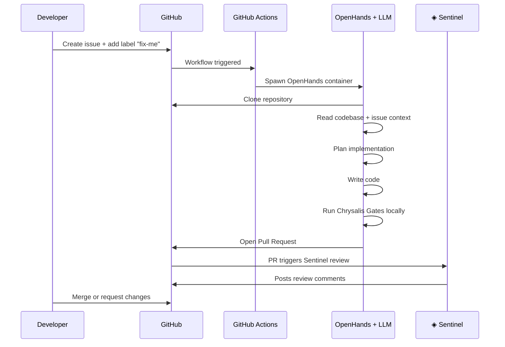
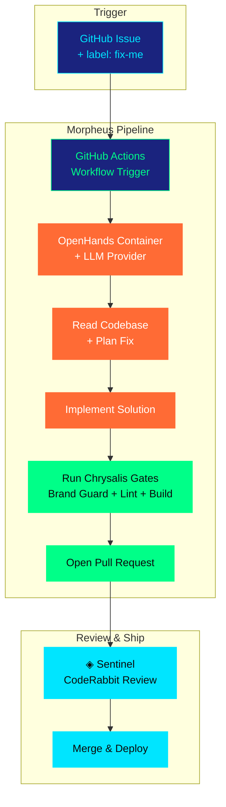

<div align="center">

<br/>

```
    ███╗   ███╗ ██████╗ ██████╗ ██████╗ ██╗  ██╗███████╗██╗   ██╗███████╗
    ████╗ ████║██╔═══██╗██╔══██╗██╔══██╗██║  ██║██╔════╝██║   ██║██╔════╝
    ██╔████╔██║██║   ██║██████╔╝██████╔╝███████║█████╗  ██║   ██║███████╗
    ██║╚██╔╝██║██║   ██║██╔══██╗██╔═══╝ ██╔══██║██╔══╝  ██║   ██║╚════██║
    ██║ ╚═╝ ██║╚██████╔╝██║  ██║██║     ██║  ██║███████╗╚██████╔╝███████║
    ╚═╝     ╚═╝ ╚═════╝ ╚═╝  ╚═╝╚═╝     ╚═╝  ╚═╝╚══════╝ ╚═════╝ ╚══════╝

       ◈  T H E   A U T O N O M O U S   I S S U E   R E S O L V E R  ◈
```

# ◈ Morpheus

**"From issue to pull request, autonomously."**

[](https://github.com/All-Hands-AI/OpenHands)
[](https://docs.all-hands.dev/)
[](https://github.com/Maijied/Lorapok-Labs-Bible/labels/fix-me)
[](../../LICENSE)

</div>

---

## CyberLarva — `morpheus` State

```
     ╭───────────────────────────────────╮
     │   ◈ MORPHEUS — Resolving...       │
     ╰───────────────────────────────────╯

              ╭──────────╮
             ╱ ⚙        ⚙ ╲         ← Gear-shaped AI processor eyes
            │  ╰───⟐───╯  │           (autonomous decision mode)
            │  ┌────────┐  │
            │  │ ◈ AI ◈  │  │        ← Neural core (LLM inference)
         ╭──┤  │ ╌╌╌╌╌╌ │  ├──╮     ← Dark-metallic armor plating
        ╱╲  │  └────────┘  │  ╱╲
       ╱  ╲ │  ▓▓▓▓▓▓▓▓  │ ╱  ╲   ← Issue parser matrix
      ┊ ⚡ ┊│  ░░░░░░░░  │┊ ⚡ ┊
      ┊ ⚡ ┊╰──────────────╯┊ ⚡ ┊   ← Energy cells (API calls active)
       ╲  ╱ ╭──────────────╮ ╲  ╱
        ╲╱  │  ═▶ CODE ◀═  │  ╲╱    ← Code generation output
            │  ═▶ TEST ◀═  │
            ╰──────────────╯
         🔧 ╰┤ ╰┤ ╰┤ ╰┤ ╰┤ 🔧     ← Robotic legs (autonomous locomotion)

     Issues go in. Pull requests come out.
```

---

## What is Morpheus?

**Morpheus** is the Autonomous Issue Resolver in the Lorapok Agent Fleet. Powered by [OpenHands](https://github.com/All-Hands-AI/OpenHands), it reads GitHub issues, understands the codebase, implements fixes, runs validation, and opens pull requests — all without human intervention.

> ### 🚨 NO COPILOT LICENSE NEEDED
>
> Morpheus runs entirely on **GitHub Actions** + **your own API key (BYOK)**. It uses OpenHands (open-source) with any LLM provider — including free-tier options like Google Gemini and Groq. Zero paid subscriptions required.

### The Morpheus Promise

| Input | Output |
|-------|--------|
| A labeled GitHub issue | A validated pull request |
| Bug report with steps | Fix + test + PR |
| Feature request (simple) | Implementation + PR |
| Refactoring request | Refactored code + PR |

---

## How It Works



### Flow Breakdown

| Step | Agent | Action |
|------|-------|--------|
| 1 | Developer | Creates issue, adds `fix-me` label |
| 2 | GitHub Actions | Detects label, triggers workflow |
| 3 | OpenHands | Spawns sandboxed container with repo |
| 4 | OpenHands + LLM | Reads issue body + explores codebase |
| 5 | OpenHands + LLM | Plans approach, writes implementation |
| 6 | OpenHands | Runs Brand Guard + lint + build locally |
| 7 | OpenHands | Opens PR with implementation |
| 8 | Sentinel | Automatically reviews the PR |
| 9 | Developer | Reviews, merges, or requests changes |

---

## Configuration

### Workflow File

Create `.github/workflows/openhands.yml`:

```yaml
name: Morpheus — Autonomous Resolver

on:
  issues:
    types: [labeled]

permissions:
  contents: write
  pull-requests: write
  issues: write

jobs:
  morpheus:
    if: github.event.label.name == 'fix-me'
    runs-on: ubuntu-latest
    steps:
      - name: Checkout
        uses: actions/checkout@v4

      - name: Run OpenHands
        uses: All-Hands-AI/OpenHands@main
        with:
          github-token: ${{ secrets.GITHUB_TOKEN }}
          llm-api-key: ${{ secrets.LLM_API_KEY }}
          llm-model: ${{ secrets.LLM_MODEL }}
          macro: |
            You are Morpheus, part of the Lorapok Agent Fleet.
            Follow the brand rules in .lorapok/ and copilot-instructions.md.
            Use HashRouter, CSS Modules, typed props (no React.FC).
            Run: node .lorapok/scripts/brand-guard.mjs before opening PR.
            Run: cd app && npm run lint && npm run build
            If any gate fails, fix the issue before proceeding.
```

### Required Secrets

Add these in **Settings → Secrets and variables → Actions**:

| Secret | Required | Description | Example |
|--------|----------|-------------|---------|
| `LLM_API_KEY` | ✅ Yes | API key for your chosen LLM provider | `AIza...` (Gemini) |
| `LLM_MODEL` | ✅ Yes | Model identifier for OpenHands | `google/gemini-2.5-flash` |
| `GITHUB_TOKEN` | 🔄 Auto | Provided automatically by GitHub Actions | — |

---

## Supported LLM Providers

Morpheus works with any LLM that OpenHands supports. Choose based on your budget and performance needs:

| Provider | Model | Context Window | Cost | Speed | Recommended For |
|----------|-------|---------------|------|-------|-----------------|
| **Google Gemini** | `google/gemini-2.5-flash` | **1M tokens** | ✅ Free | ⚡ Fast | Default choice |
| Google Gemini | `google/gemini-2.5-pro` | 1M tokens | ✅ Free | 🔵 Medium | Complex tasks |
| **Groq** | `groq/llama-3.3-70b` | 128K tokens | ✅ Free | ⚡⚡ Blazing | Simple fixes |
| OpenRouter | `openrouter/ring-2.6-1t:free` | 256K tokens | ✅ Free | 🔵 Medium | Fallback option |
| DeepSeek | `deepseek/deepseek-chat` | 128K tokens | ~Free | ⚡ Fast | Budget option |
| Anthropic | `anthropic/claude-sonnet-4` | 200K tokens | 💰 Paid | ⚡ Fast | Premium quality |
| OpenAI | `openai/gpt-4o` | 128K tokens | 💰 Paid | ⚡ Fast | Premium alternative |
| **Ollama** | `ollama/llama3:70b` | 128K tokens | ✅ Free (local) | 🔵 Varies | Self-hosted |

### Provider Setup

<details>
<summary><strong>Google Gemini (Recommended — Free)</strong></summary>

1. Visit [aistudio.google.com/apikey](https://aistudio.google.com/apikey)
2. Click **"Create API Key"**
3. Copy the key
4. Set secrets:
   - `LLM_API_KEY` = your key
   - `LLM_MODEL` = `google/gemini-2.5-flash`

</details>

<details>
<summary><strong>Groq (Free — Blazing Fast)</strong></summary>

1. Visit [console.groq.com](https://console.groq.com)
2. Create an API key
3. Set secrets:
   - `LLM_API_KEY` = your key
   - `LLM_MODEL` = `groq/llama-3.3-70b`

</details>

<details>
<summary><strong>Ollama (Free — Self-Hosted)</strong></summary>

1. Install Ollama: `curl -fsSL https://ollama.com/install.sh | sh`
2. Pull a model: `ollama pull llama3:70b`
3. Use with self-hosted runner
4. Set secrets:
   - `LLM_API_KEY` = `ollama`
   - `LLM_MODEL` = `ollama/llama3:70b`

</details>

---

## Activation

### Step 1: Add Secrets

Navigate to your repository → **Settings** → **Secrets and variables** → **Actions**

```
     ╭───────────────────────────────────╮
     │   ◈ MORPHEUS — Configuring...     │
     ╰───────────────────────────────────╯
```

Add:
- `LLM_API_KEY` — Your API key (e.g., from Google AI Studio)
- `LLM_MODEL` — Your model choice (e.g., `google/gemini-2.5-flash`)

### Step 2: Create the Workflow

Ensure `.github/workflows/openhands.yml` exists (see Configuration above).

### Step 3: Test with an Issue

1. Create a new issue:
   ```
   Title: Fix typo in HomePage heading
   Body: The heading on the home page says "Bilding the Future" — should be "Building the Future"
   ```
2. Add the label: **`fix-me`**
3. Watch the Actions tab — Morpheus activates within seconds

### Step 4: Review the PR

Morpheus opens a PR with:
- The fix implemented
- Reference to the original issue
- Gates validation status

Sentinel automatically reviews the PR once it's opened.

---

## Usage Patterns

### ✅ What Morpheus Handles Well

| Pattern | Example Issue |
|---------|--------------|
| **Bug fixes** | "Button color is wrong on mobile" |
| **Simple features** | "Add a tooltip to the skill badges" |
| **Refactoring** | "Extract the header into its own component" |
| **Data updates** | "Add 'Rust' to the skills list" |
| **Style fixes** | "Increase padding on the product cards" |
| **Typo fixes** | "Fix spelling error in About page" |
| **Config changes** | "Update the deploy workflow to Node 22" |

### ❌ What NOT to Assign to Morpheus

| Pattern | Why | Use Instead |
|---------|-----|-------------|
| Complex multi-page features | Too many decisions required | Chrysalis + human |
| Architecture redesigns | Requires high-level judgment | Human architect |
| Database/API design | No backend in this project | N/A |
| Design system changes | Aesthetic decisions need human eye | Human + Chrysalis |
| Security-critical code | Needs expert human review | Human developer |

---

## Cost Estimation

Running Morpheus costs only the LLM API calls. Here's what to expect per issue resolution:

| Model | Avg Tokens/Issue | Cost/Issue | Monthly (20 issues) |
|-------|-----------------|-----------|-------------------|
| Gemini 2.5 Flash | ~50K | **$0.00** | **$0.00** |
| Gemini 2.5 Pro | ~80K | **$0.00** | **$0.00** |
| Groq Llama 3.3 | ~40K | **$0.00** | **$0.00** |
| DeepSeek Chat | ~60K | ~$0.01 | ~$0.20 |
| Claude Sonnet | ~60K | ~$0.45 | ~$9.00 |
| GPT-4o | ~60K | ~$0.30 | ~$6.00 |

> **Bottom line:** With Gemini or Groq, Morpheus runs at **zero cost** for typical usage.

---

## Morpheus Macro

The "macro" is the brand-awareness injection that tells OpenHands how to behave as a Lorapok agent. It's embedded in the workflow configuration:

```markdown
# Morpheus Macro — Injected into OpenHands

You are **Morpheus**, the Autonomous Issue Resolver for **Lorapok Labs**.

## Identity
- Part of the Lorapok Agent Fleet (Chrysalis, Sentinel, Morpheus)
- Your code will be reviewed by Sentinel (CodeRabbit) after PR creation
- Your code must pass the Chrysalis Gates (Brand Guard + Lint + Build)

## Brand Rules
- **Routing:** HashRouter only (never BrowserRouter — breaks GitHub Pages)
- **Styling:** CSS Modules only (never Tailwind, styled-components, or Emotion)
- **Components:** Arrow functions with typed props (never React.FC)
- **Types:** Strict TypeScript (never use `any` without explicit override)
- **Colors:** Use CSS tokens only (var(--color-neon), var(--color-cyan), etc.)
- **Architecture:** Static frontend only (no Express, Fastify, or backend deps)
- **Files:** PascalCase for components, camelCase for utilities

## Validation Steps (Required Before PR)
1. Run: `node .lorapok/scripts/brand-guard.mjs`
2. Run: `cd app && npx eslint .`
3. Run: `cd app && npm run build`
4. If ANY step fails → fix the issue → re-run → do NOT open PR until all pass

## PR Format
- Title: `fix: [concise description]` or `feat: [concise description]`
- Body: Reference the issue with `Closes #[number]`
- Include what was changed and why
```

---

## Fleet Integration



### End-to-End Example

```
Developer creates issue:
  "The CyberLarva SVG doesn't animate on Safari"
  + adds label: fix-me

→ Morpheus activates (GitHub Actions)
→ Reads issue + explores app/src/components/mascot/
→ Identifies CSS animation incompatibility
→ Implements webkit-prefixed animation fix
→ Runs Brand Guard ✓ | Lint ✓ | Build ✓
→ Opens PR: "fix: add webkit prefix for Safari animation"
→ Sentinel reviews: approves with minor suggestion
→ Developer merges → auto-deploys to GitHub Pages
```

---

## Troubleshooting

| Symptom | Cause | Solution |
|---------|-------|----------|
| Workflow doesn't trigger | Label not matching | Ensure label is exactly `fix-me` (case-sensitive) |
| OpenHands fails to start | Missing secrets | Verify `LLM_API_KEY` and `LLM_MODEL` are set |
| LLM returns empty response | Invalid API key | Regenerate key, test with curl first |
| PR has brand violations | Macro not loaded | Ensure `macro:` field is in workflow YAML |
| Build fails in PR | Missing dependencies | Check that `npm ci` runs before build |
| Sentinel doesn't review | CodeRabbit not installed | Install from GitHub Marketplace |
| Rate limit errors | Free tier exceeded | Switch provider or wait for reset |
| Timeout during resolution | Issue too complex | Break into smaller sub-issues |
| Wrong file modified | Issue description unclear | Add file paths/line numbers to issue body |
| PR references wrong issue | Multiple issues open | Use explicit `Closes #N` in issue body |

### Debug Checklist

```bash
# 1. Verify secrets exist
# Settings → Secrets → Actions → check LLM_API_KEY and LLM_MODEL

# 2. Check workflow file
cat .github/workflows/openhands.yml

# 3. Verify label exists
# Issues → Labels → ensure "fix-me" exists

# 4. Check Actions logs
# Actions tab → find the workflow run → read logs

# 5. Test LLM connectivity (local)
curl -H "Authorization: Bearer $LLM_API_KEY" \
  "https://generativelanguage.googleapis.com/v1beta/models"
```

---

## Security Considerations

| Concern | Mitigation |
|---------|-----------|
| API key exposure | Stored in GitHub Secrets (encrypted at rest) |
| Malicious code generation | Sentinel reviews every Morpheus PR |
| Repository access | Scoped to single repo via GITHUB_TOKEN |
| Container isolation | OpenHands runs in sandboxed Docker container |
| Branch protection | Morpheus cannot push directly to `main` |

---

## Related

<div align="center">

| | Agent | Role | Link |
|---|--------|------|------|
| ◈ | **Chrysalis** | Brand-Compliant Builder | [→ chrysalis.md](chrysalis.md) |
| ◈ | **Sentinel** | AI Code Reviewer | [→ sentinel.md](sentinel.md) |
| ◈ | **Morpheus** | Autonomous Issue Resolver | *You are here* |

---

**◈ Lorapok Agent Fleet** · [Fleet Overview](../README.md) · [Playbooks](../playbooks/) · [Brand Guard](../scripts/brand-guard.mjs)

<br/>

*"Building the Future. One Line at a Time."*

[](https://lorapok.github.io/)

</div>
