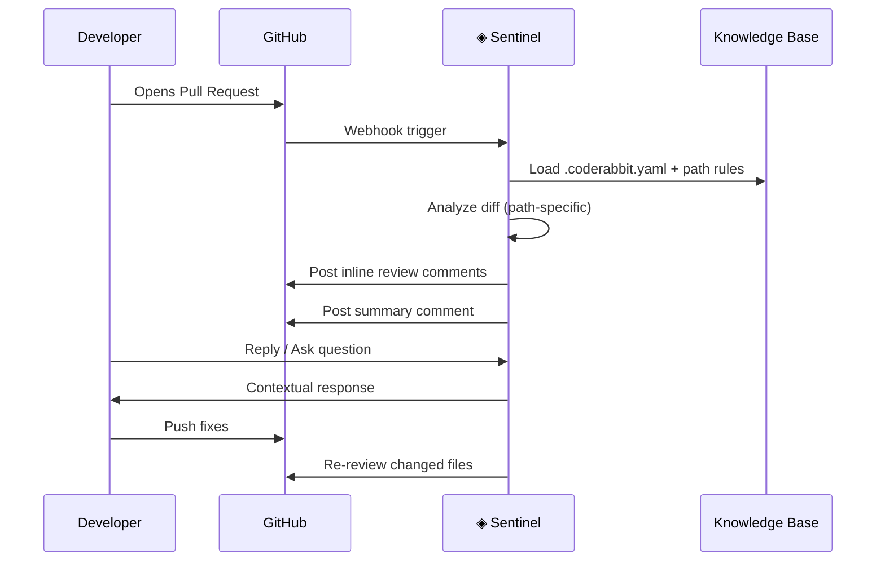
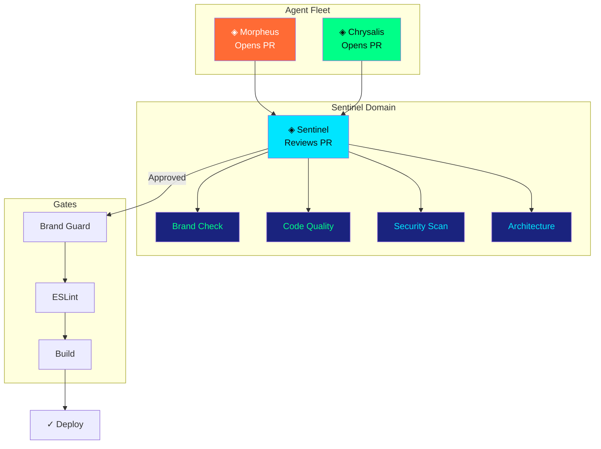

<div align="center">

<br/>

```
    ███████╗███████╗███╗   ██╗████████╗██╗███╗   ██╗███████╗██╗
    ██╔════╝██╔════╝████╗  ██║╚══██╔══╝██║████╗  ██║██╔════╝██║
    ███████╗█████╗  ██╔██╗ ██║   ██║   ██║██╔██╗ ██║█████╗  ██║
    ╚════██║██╔══╝  ██║╚██╗██║   ██║   ██║██║╚██╗██║██╔══╝  ██║
    ███████║███████╗██║ ╚████║   ██║   ██║██║ ╚████║███████╗███████╗
    ╚══════╝╚══════╝╚═╝  ╚═══╝   ╚═╝   ╚═╝╚═╝  ╚═══╝╚══════╝╚══════╝

              ◈  T H E   A I   C O D E   R E V I E W E R  ◈
```

# ◈ Sentinel

**"Every line reviewed. Every PR guarded."**

[](https://github.com/marketplace/coderabbitai)
[](https://docs.coderabbit.ai/pricing)
[](../../.coderabbit.yaml)
[](../../LICENSE)

</div>

---

## CyberLarva — `sentinel` State

```
     ╭───────────────────────────────────╮
     │   ◈ SENTINEL — Reviewing...       │
     ╰───────────────────────────────────╯

              ╭──────────╮
             ╱  ⊙    ⊙   ╲         ← All-seeing review eyes (electric cyan)
            │   ╰─◈──╯    │           (scanning every diff line)
            │  ┌────────┐  │
            │  │ ◇◇◇◇◇◇ │  │        ← Optical sensor array
         ╭──┤  │ ◇◇◇◇◇◇ │  ├──╮     ← Dark-metallic armor plating
        ╱╲  │  └────────┘  │  ╱╲
       ╱  ╲ │  ┌──┐  ┌──┐  │ ╱  ╲   ← Dual-core analysis processors
      ┊ ◈◈ ┊│  │▓▓│  │▓▓│  │┊ ◈◈ ┊
      ┊ ◈◈ ┊╰──┴──┴──┴──┴──╯┊ ◈◈ ┊  ← Knowledge-base memory banks
       ╲  ╱ ╭──────────────╮ ╲  ╱
        ╲╱  │  ═══════════ │  ╲╱    ← Verdict output bus
            │  ▶ APPROVED ◀ │
            ╰──────────────╯
         🔍 ╰┤ ╰┤ ╰┤ ╰┤ ╰┤ 🔍     ← Anchored (stationary review mode)

     No PR escapes unreviewed.
```

---

## What is Sentinel?

**Sentinel** is the AI Code Reviewer in the Lorapok Agent Fleet. Powered by [CodeRabbit](https://coderabbit.ai), it automatically reviews every pull request with path-specific intelligence — understanding that a change in `components/` requires different scrutiny than a change in `data/` or `styles/`.

Sentinel enforces the Lorapok brand system at the review level:
- 🎨 **Brand Compliance** — Are CSS tokens used correctly? Is the Biological UI aesthetic preserved?
- 🏗️ **Architecture** — Does the code follow the established patterns? Are components properly scoped?
- 🔒 **Security** — Are there exposed secrets, unsafe patterns, or XSS vulnerabilities?
- ⚡ **Performance** — Are there unnecessary re-renders, missing memoization, or bundle bloat?

> **Cost: $0/month forever** — CodeRabbit's Open Source plan provides unlimited reviews for public repositories.

---

## How It Works



| Step | What Happens |
|------|-------------|
| **1. PR Opened** | Any push to a branch with an open PR triggers Sentinel |
| **2. Context Loaded** | Reads `.coderabbit.yaml` for path rules, tone, and focus areas |
| **3. Path-Specific Review** | Applies different review criteria based on file location |
| **4. Inline Suggestions** | Posts code suggestions directly on the diff lines |
| **5. Auto-Reply** | Responds to developer questions in review threads |

---

## Path-Specific Intelligence

Sentinel applies different review lenses based on where the changes are:

| Path Pattern | Review Focus | Key Checks |
|-------------|-------------|------------|
| `app/src/components/**` | Component quality | Props typing, CSS module usage, accessibility, re-render risk |
| `app/src/pages/**` | Page architecture | Route registration, layout integration, SEO metadata |
| `app/src/data/**` | Data integrity | Type safety, interface compliance, no stale references |
| `app/src/styles/**` | Brand compliance | Token usage, no hardcoded colors, animation performance |
| `.lorapok/**` | Fleet integrity | Script correctness, playbook format, manifest schema |
| `package.json` | Dependency safety | No banned deps, version pinning, bundle size impact |

### Example Configuration

```yaml
# .coderabbit.yaml
reviews:
  path_instructions:
    - path: "app/src/components/**"
      instructions: |
        Review for:
        - Proper CSS Module imports (*.module.css)
        - No inline styles or hardcoded colors
        - Props typed with interface (not React.FC)
        - Framer Motion for animations
        - Accessibility (aria labels, semantic HTML)

    - path: "app/src/data/**"
      instructions: |
        Review for:
        - TypeScript interfaces properly defined
        - Data matches expected schema
        - No 'any' types
        - Proper exports

    - path: "app/src/styles/**"
      instructions: |
        Review for:
        - Only CSS custom properties (var(--*))
        - No hardcoded hex/rgb values
        - Proper token naming (--color-*, --space-*, --radius-*)
        - Animation performance (prefer transform/opacity)
```

---

## Activation

Getting Sentinel running takes under 60 seconds:

### Step 1: Install CodeRabbit

```
     ╭───────────────────────────────────╮
     │   ◈ SENTINEL — Installing...      │
     ╰───────────────────────────────────╯
```

1. Navigate to **[github.com/marketplace/coderabbitai](https://github.com/marketplace/coderabbitai)**
2. Click **"Set up a plan"**
3. Select **"Open Source"** — $0/month, unlimited repos

### Step 2: Grant Repository Access

1. Choose **"Only select repositories"**
2. Select your Lorapok repository
3. Click **"Install & Authorize"**

### Step 3: Add Configuration (Optional)

Create `.coderabbit.yaml` in your repository root:

```yaml
language: en-US
tone_instructions: >
  You are reviewing code for Lorapok Labs. The project uses a Biological UI
  design system with neon-on-dark glassmorphism. Enforce CSS Modules, typed
  props, HashRouter, and zero-backend architecture. Be thorough but constructive.
reviews:
  auto_review:
    enabled: true
  path_instructions:
    - path: "app/src/**"
      instructions: "Enforce Lorapok brand system. No Tailwind, no CSS-in-JS, no BrowserRouter."
chat:
  auto_reply: true
```

### Step 4: Done

Open any PR — Sentinel reviews it automatically within seconds.

---

## What Sentinel Reviews

### 🎨 Brand Compliance

| Check | What It Looks For |
|-------|-------------------|
| CSS Token Usage | `var(--color-neon)` instead of `#00ff88` |
| Component Patterns | Arrow functions, not `React.FC` |
| Routing | `HashRouter` only, no `BrowserRouter` |
| Styling | CSS Modules (`.module.css`), no Tailwind/CSS-in-JS |
| File Naming | PascalCase components, camelCase utilities |

### 🏗️ Code Quality

| Check | What It Looks For |
|-------|-------------------|
| Type Safety | No `any`, proper generics, strict interfaces |
| Import Order | External → Internal → Relative → Styles |
| Component Size | Flags components over 200 lines |
| Prop Drilling | Suggests composition or context patterns |
| Dead Code | Unused imports, unreachable branches |

### 🔒 Security

| Check | What It Looks For |
|-------|-------------------|
| Exposed Secrets | API keys, tokens in code |
| XSS Vectors | Unsafe `dangerouslySetInnerHTML` usage |
| Dependency Risk | Known vulnerabilities in new packages |
| Data Validation | Unvalidated external inputs |

### ⚡ Architecture

| Check | What It Looks For |
|-------|-------------------|
| Separation of Concerns | Data in `data/`, UI in `components/` |
| Route Structure | Pages export default, register in router |
| State Management | No prop drilling beyond 2 levels |
| Bundle Impact | Large imports, missing code splitting |

---

## Interacting with Sentinel

Sentinel is conversational. You can interact directly in PR comments:

### Accept a Suggestion

Click the **"Commit suggestion"** button on any inline suggestion to apply it directly.

### Ask a Question

```markdown
@coderabbitai Why did you flag this import?
```

Sentinel will reply with context-aware explanation.

### Override a Suggestion

```markdown
@coderabbitai This is intentional because [reason].
```

Sentinel acknowledges and learns for future reviews.

### Request Re-review

```markdown
@coderabbitai review
```

Triggers a fresh review of the entire PR.

### Generate Summary

```markdown
@coderabbitai summary
```

Generates a high-level summary of all changes.

---

## Why CodeRabbit?

| Feature | Benefit for Lorapok |
|---------|-------------------|
| **Free for OSS** | $0/month forever for public repos |
| **Path-specific rules** | Different review logic per directory |
| **Knowledge base** | Learns project conventions over time |
| **Auto-reply** | Responds to developer questions in threads |
| **Sequence diagrams** | Auto-generates flow diagrams for complex changes |
| **Incremental review** | Only re-reviews changed lines on new pushes |
| **Multi-language** | Reviews TypeScript, CSS, YAML, JSON, Markdown |
| **PR summaries** | Generates walkthrough tables for every PR |
| **No token cost** | Doesn't consume your API credits |

---

## Fleet Integration



### Integration Flow

1. **Morpheus** resolves an issue → Opens a PR
2. **Chrysalis** implements a task → Opens a PR
3. **Sentinel** automatically reviews the PR
4. Developer addresses feedback or merges
5. **Chrysalis Gates** run on merge → Deploy

> Sentinel acts as the quality gatekeeper between agent-generated code and production.

---

## Advanced Configuration

### Custom Instructions per Path

```yaml
reviews:
  path_instructions:
    - path: "app/src/components/ui/**"
      instructions: |
        These are reusable UI primitives. Check:
        - Proper forwardRef usage for DOM components
        - CSS custom properties for all visual values
        - Framer Motion variants for animations
        - className prop support via cn() utility

    - path: "app/src/components/layout/**"
      instructions: |
        Layout components define app structure. Check:
        - Responsive breakpoints use CSS tokens
        - No fixed widths (use min/max/clamp)
        - Proper semantic HTML (nav, main, aside, footer)
        - Keyboard navigation support

    - path: ".github/workflows/**"
      instructions: |
        CI/CD configuration. Check:
        - Node 20 specified
        - Proper caching configuration
        - Security: no secrets in logs
        - Proper job dependencies
```

### Knowledge Base Integration

Sentinel can reference a knowledge base to learn project-specific patterns:

```yaml
knowledge_base:
  learnings:
    - "This project uses HashRouter because it deploys to GitHub Pages"
    - "CSS Modules are required. Never suggest Tailwind or styled-components"
    - "Components use arrow functions with typed props, not React.FC"
    - "The mascot is called CyberLarva and appears in CLI output"
```

---

## Related

<div align="center">

| | Agent | Role | Link |
|---|--------|------|------|
| ◈ | **Chrysalis** | Brand-Compliant Builder | [→ chrysalis.md](chrysalis.md) |
| ◈ | **Sentinel** | AI Code Reviewer | *You are here* |
| ◈ | **Morpheus** | Autonomous Issue Resolver | [→ morpheus.md](morpheus.md) |

---

**◈ Lorapok Agent Fleet** · [Fleet Overview](../README.md) · [Playbooks](../playbooks/) · [Brand Guard](../scripts/brand-guard.mjs)

<br/>

*"Building the Future. One Line at a Time."*

[](https://lorapok.github.io/)

</div>
